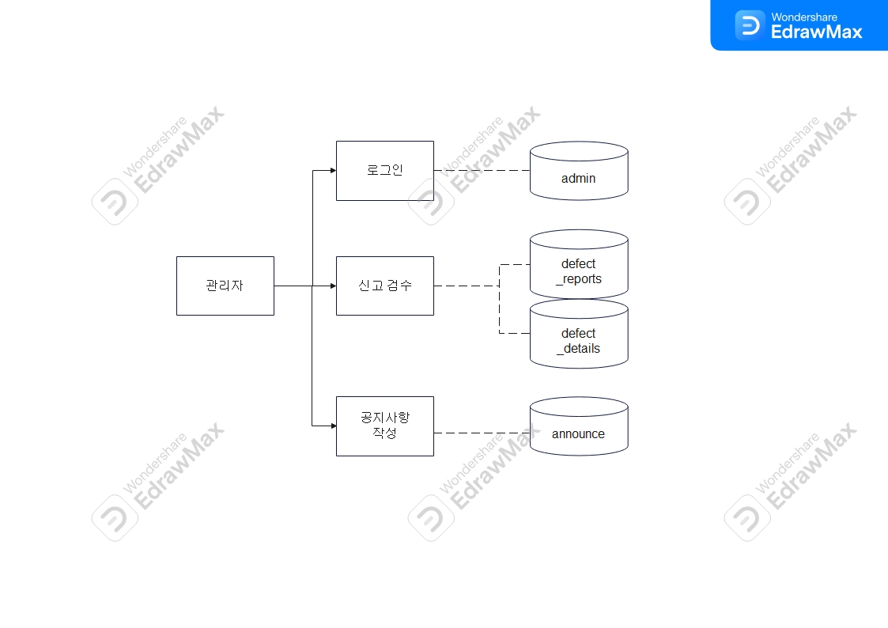
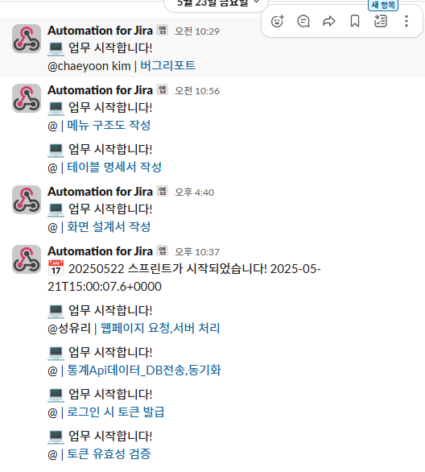

# KH아카데미 파일럿 프로젝트_리콜 센터
made by. team_KH리콜안전공단

**Spring Boot,React 기반 리콜 정보 조회 사이트**
빅데이터 기반(파이썬·자바·웹) 엘라스틱 검색엔진 개발자과정 `2025. 01. 15 ~ 2025. 07. 10`

<br>

1조 3차 프로젝트 진행 기간 `2025. 05. 19 ~ 2025. 05. 25`

[마이그레이션 전 [파일럿 프로젝트 링크](https://github.com/Wjyuy/project_2)]

## 프로젝트 포스터


## 💡 프로젝트 선정 배경

* [파일럿 프로젝트](https://github.com/Wjyuy/project_2)에서 재작한 기존 JSP 기반의 리콜 정보 시스템은 유지보수와 확장성, 사용자 경험(UX) 측면에서 한계 발견
* 최신 웹 트렌드에 맞는 **React 기반 SPA**로 프론트엔드 마이그레이션
* Spring Boot 백엔드, REST API 연동

---

### 사용 기술 스택

- **Frontend**
  - React (SPA, React Router)
  - JavaScript (ES6+)
  - CSS3, HTML5
  - UI 프레임워크: UIKit, Bootstrap 등
- **Backend**
  - Spring Boot (REST API)
  - Java 17+
  - MyBatis 
  - Gradle 
  - Flask
  - JWT token
- **Database & Infra**
  - MySQL
  - pgAdmin4 (DB 관리)
  - Render (클라우드 배포)
- **기타**
  - Sourcetree
  - GitHub 
  - Slack
  - Jira
  - Notion 

## 설계

### DB diagram을 사용한 erd 테이블 설계


### 업무 흐름도
<table>
  <tr>
    <td align="center">센터,통계</td>
    <td align="center">관리자</td>
    <td align="center">리콜정보,결함신고</td>
  </tr>
  <tr>
    <td></td>
    <td></td>
    <td></td>
  </tr>
</table>

### 서비스 설계단 흐름
<table>
  <tr>
    <td align="center">메뉴 구조도</td>
  </tr>
  <tr>
    <td></td>
    <td></td>
  </tr>
</table>

### 기타 문서
  * <a href="./pptx/테이블명세서.pdf" download="document.pdf">테이블 명세서</a>
  * <a href="./pptx/화면설계서.pdf" download="document.pdf">화면 설계서</a>
---

## 협업툴 자동화 활용

  <table>
    <tr>
      <td align="center">slack</td>
      <td align="center">jira</td>
    </tr>
    <tr>
      <td></td>
      <td></td>
    </tr>
  </table>

## 🚀 주요 기능

- **리콜 정보 검색/상세 조회**
  - 다양한 조건(제품명, 제조사, 모델명 등)으로 리콜 내역 검색
  - 반응형 테이블 및 상세 정보 제공
  - Flask 사용한 유사 리콜 기능 구현
- **결함 신고 및 내역 조회/수정**
  - 사용자 결함 신고 등록 및 본인 신고 내역 확인/수정
  - 신고 시 비밀번호, 공개여부 등 선택 가능
- **공지사항/FAQ 게시판**
  - 관리자 공지 작성, FAQ 관리
  - 사용자 공지/FAQ 열람
  - 다양한 조건으로 게시판 검색
- **리콜 통계**
  - 연도별, 제조사별, 월별 등 다양한 통계 시각화
  - PDF 다운로드 구현, Gemini를 사용한 통계분석 기능
  - 중복 리콜 모델을 카운트하여 시각화
- **관리자 기능**
  - JWT 토큰으로 로그인, 로그아웃 구현
  - 리콜 정보 검수/승인, 공지사항 작성, 데이터 동기화 
- **첨부파일 다운로드**
  - 리콜/신고 내역 엑셀, CSV, 리콜통계 PDF 등 파일 다운로드 지원
- **반응형 UI**
  - PC/모바일 모두 최적화된 화면 제공
  - Gemini를 사용한 챗봇 기능, 프롬프트를 사용해 페이지와 관계있는 질문에만 대답

---

## 📁 폴더 구조 및 마이그레이션 설명

- `src/main/frontend`  
  - 기존 JSP 기반 프론트엔드-> React SPA 마이그레이션  
  - 각 JSP 화면을 React 컴포넌트/페이지로 분리  
  - React Router로 URL 기반 화면 전환  
  - `src/main/frontend/src/service`: REST API로 Spring Boot 백엔드와 연동

- `src/main/java/com/boot`  
  - Controller, DAO, DTO, Mapper 등 백엔드 비즈니스 로직  
  - `React...Controller`: React로 마이그레이션하며 Json전송 RestController 전체변환
  - Gradle 기반 빌드/의존성 관리  
  - `webapp` 폴더에 마이그레이션 전 JSP 파일 보관

---

## 마이그레이션 완료된 React 디렉토리 구조
```
.
└── RECALL_FINAL
    ├── gradle/
    ├── images/
    ├── node_modules/
    └── src/
        └── main/
            └── frontend/
                ├── node_modules/
                ├── public/
                ├── src/
                │   ├── assets/
                │   ├── components/
                │   ├── hooks/
                │   ├── layout/
                │   ├── pages/
                │   ├── services/
                │   ├── styles/
                │   ├── utils/
                │   ├── App.js
                │   ├── App.test.js
                │   ├── appbackup.js
                │   ├── index.css
                │   ├── index.js
                │   ├── logo.svg
                │   ├── reportWebVitals.js
                │   ├── setupProxy.js
                │   └── setupTests.js
                ├── .env.development
                ├── .env.production
                ├── .gitignore
                ├── package-lock.json
                └── package.json
```

## 🛠️ 마이그레이션 방식 요약

- JSP에서 처리하던 화면/로직을 React **컴포넌트로 분리**
- 서버 템플릿 렌더링 → 클라이언트 렌더링(SPA)
- 페이지 이동은 **React Router로 구현 (새로고침 없이 전환)**
- 데이터 연동은 **REST API 호출**(fetch/axios 등)
- 공통 레이아웃(헤더/푸터/네비) 컴포넌트화
- 반응형 UI 및 사용자 경험(UX) 개선

---

## 결과

### 메인 화면
<table>
  <tr>
    <td align="center">메인화면</td>
    <td align="center">챗봇 채팅 화면</td>
  </tr>
  <tr>
    <td></td>
    <td></td>
  </tr>
</table>

- 플로팅 버튼으로 TOP VIEW , CHATBOT 기능 구현
- CHATBOT 은 popup으로, 리액트 라우터 구현이기 때문에 페이지 전환되어도 채팅기록 남음
- 드래그 앤 드랍 위치도 고정

### 리콜 정보 
<table>
  <tr>
    <td align="center">리콜내역</td>
    <td align="center">리콜내역 기능</td>
  </tr>
  <tr>
    <td></td>
    <td></td>
  </tr>
</table>

- 플로팅 버튼으로 TOP VIEW , CHATBOT 기능 구현
- CHATBOT 은 popup으로, 리액트 라우터 구현이기 때문에 페이지 전환되어도 채팅기록 남음
- 드래그 앤 드랍 위치도 고정


## 🔗 관련 링크 (레파지토리링크수정필요!!!!!!!!!!!!!!!!!!!!!!!!)
  * **GitHub Repository:** 
    * [[팀장 우주연-GitHub Repository URL](https://github.com/Wjyuy/KH_PJ4)]
    * [[팀원 성유리-GitHub Repository URL](https://github.com/yuriuser126/ShoFriend_project3)]
    * [[팀원 김채윤-GitHub Repository URL](https://github.com/Chaeyoon-k/pilotproject_03)]
    * [[팀원 권준우-GitHub Repository URL](https://github.com/kjo5191/ShoFriend)]

  * **발표자료** 

  * <a href="./pptx/pptx.pdf" download="document.pdf">PDF 미리보기</a>
  * [최신 발표 자료 다운로드 (릴리스)](https://github.com/Wjyuy/Recall_Final/releases/tag/latest)

  * **시연영상 보기**

  [](https://www.youtube.com/watch?v=cTVAbfrtdEs)